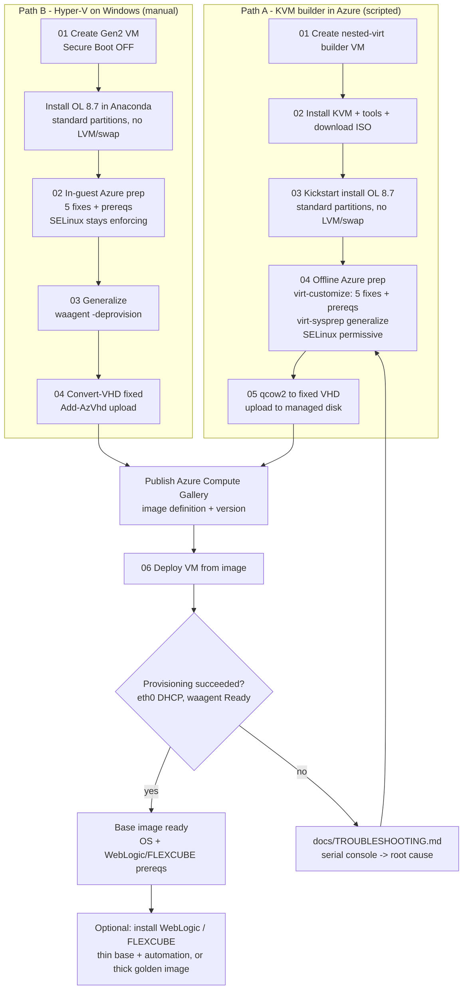
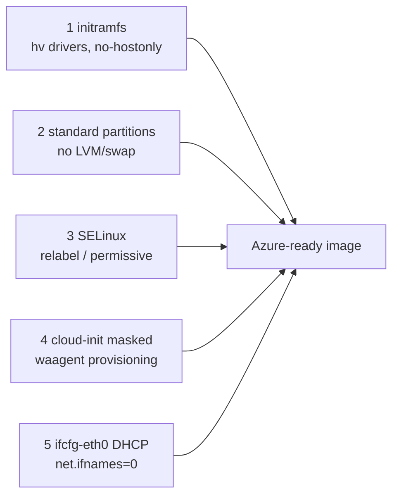

# Oracle Linux 8.7 → Azure Compute Gallery image builder

Reproducible pipeline to build a **custom Oracle Linux 8.7 (x86_64)** image for
Azure — prepared for **Oracle FLEXCUBE 14.8 / WebLogic** — and publish it to an
**Azure Compute Gallery**.

Oracle Linux 8.7 is **not in the Azure Marketplace**, so it must be built,
generalized, and uploaded as a custom image. This repo captures a **known-good**
process, including every non-obvious fix required to make a hand-built OL image
boot and provision correctly on Azure.

> Built and validated end-to-end: a VM deployed from the resulting image reaches
> `Provisioning succeeded`, gets an `eth0` DHCP address, swaps on the temp disk,
> and has the WebLogic/FLEXCUBE prerequisites preinstalled.

---

## Two build paths

Both produce the same Azure-ready image. Pick the one that matches your host.

| Path | Host | Automation | Guide |
|------|------|-----------|-------|
| **A. KVM builder in Azure** | Azure Linux VM (nested virt) | Fully scripted (kickstart + virt-customize) | this README + `docs/PROCESS.md` |
| **B. Hyper-V on Windows** | Local Windows Pro/Enterprise | Manual install + in-guest prep | **`docs/HYPERV-WINDOWS.md`** |

- **Path A** (this README): OL 8.7 is x86_64; an Azure Dv3/Dsv3/Fsv2 VM exposes
  nested virtualization so KVM runs the guest at native speed. Linux tooling
  (`virt-install`, `qemu-img`, `virt-customize`, `virt-sysprep`, `azcopy`) makes
  it fully repeatable.
- **Path B** (`docs/HYPERV-WINDOWS.md`): build by hand on a local Windows machine
  with Hyper-V. No `virt-customize`, so Azure prep runs **inside the guest**
  (`scripts/hyperv/`), and the disk is converted with `Convert-VHD` + `Add-AzVhd`.
  Because edits happen in a running system, **SELinux can stay `enforcing`**.

The five root-cause fixes below apply to **both** paths — only *how* they’re
applied differs (offline `virt-customize` vs. in-guest shell).

---

## Pipeline

| Step | Script | Runs on |
|------|--------|---------|
| 0 | `scripts/00-config.sh` | (sourced by all) |
| 1 | `scripts/01-create-builder.sh` | your workstation (az) |
| 2 | `scripts/02-setup-builder.sh` | the builder VM |
| 3 | `scripts/03-install-ol87.sh` | the builder VM |
| 4 | `scripts/04-azure-prep.sh` | the builder VM |
| 5 | `scripts/05-convert-upload.sh` | the builder VM (az) |
| 6 | `scripts/06-deploy-test.sh` | your workstation (az) |

Kickstart: `kickstart/ol87-azure.ks` (standard partitions, no LVM, no swap).

---

## Flow diagram



### The 5 fixes (applied at the highlighted prep step)



---

## Quick start

```bash
# 0) Configure (edit values or export env vars)
export SUBSCRIPTION_ID="xxxxxxxx-xxxx-xxxx-xxxx-xxxxxxxxxxxx"
export LOCATION="westus2"          # pick a region WITH nested-virt capacity
export IMAGE_VERSION="1.0.0"

# 1) Create the nested-virt builder (tries several sizes for capacity)
bash scripts/01-create-builder.sh          # prints the builder public IP

# copy the repo to the builder, then SSH in:
scp -r . azureuser@<BUILDER_IP>:~/oel-builder/
ssh azureuser@<BUILDER_IP>
cd ~/oel-builder

# 2) Install KVM + tools + download ISO
bash scripts/02-setup-builder.sh

# 3) Unattended OL 8.7 install (standard partitions, no LVM/swap)
bash scripts/03-install-ol87.sh

# 4) Offline Azure preparation (the 5 critical fixes) + generalize
bash scripts/04-azure-prep.sh

# 5) Convert to fixed VHD + upload + publish gallery image
az login --use-device-code
bash scripts/05-convert-upload.sh

# 6) Back on your workstation: deploy a test VM and validate
bash scripts/06-deploy-test.sh
```

Deploy a real VM from the image:

```bash
IMG=$(az sig image-version show -g "$RG" --gallery-name "$GALLERY" \
  --gallery-image-definition "$IMAGE_DEF" --gallery-image-version "$IMAGE_VERSION" --query id -o tsv)
az vm create -g <rg> -n <vm> --image "$IMG" --size <size> \
  --admin-username azureuser --admin-password '<pwd>'
```

---

## The 5 root causes (why hand-built OL images fail on Azure)

Every one of these produced the same opaque symptom —
`OSProvisioningTimedOut` — but for different reasons. They are all fixed in
`scripts/04-azure-prep.sh`.

1. **initramfs without Hyper-V drivers / hostonly.** A guest built under
   QEMU/KVM bakes an initramfs that can’t find the root disk on Hyper-V
   (`dracut-initqueue timeout`). Fix: `dracut --no-hostonly --regenerate-all`
   with `hv_vmbus hv_netvsc hv_storvsc hv_utils`, for **all** kernels.

2. **LVM root.** LVM makes the above worse and risks name clashes. Fix: install
   with **standard partitions** (kickstart: EFI + /boot + / , no LVM, no swap).

3. **SELinux mislabeling.** Editing the image offline with libguestfs leaves
   files `unlabeled_t`; in **enforcing** mode the kernel blocks *all* exec, so
   every service — including waagent — dies with `Permission denied`. Fix:
   `SELINUX=permissive` + `/.autorelabel` (harden later, see below).

4. **cloud-init vs waagent.** A stock OL ISO has **no Azure datasource** for
   cloud-init, so `Provisioning.Agent=auto` stalls. Switching to
   `Provisioning.Agent=waagent` then fails with *“cloud-init appears to be
   installed and enabled”*. Fix: waagent provisioning **+ mask cloud-init**.

5. **NIC name mismatch.** With `net.ifnames=0` the primary NIC is **eth0**, but
   the installer only wrote `ifcfg-enpXsY`, so eth0 never comes up → no route to
   the wireserver → provisioning times out. Fix: write `ifcfg-eth0` (DHCP),
   remove the `enp*` config.

Plus: `udf`/`vfat` modules (Azure passes provisioning config on a UDF dvd),
swap on the **temporary resource disk** (never the OS disk), and the
WebLogic/FLEXCUBE prerequisites.

---

## What the image contains (and what it does NOT)

This is a **thin / base image**: a hardened OS with the OS-level prerequisites,
**not** the middleware itself.

**Included:**
- Oracle Linux 8.7 (x86_64), Azure-ready (the 5 fixes above).
- WebLogic/FLEXCUBE **OS prerequisite packages**: `binutils gcc gcc-c++ glibc
  glibc-devel glibc-langpack-en libaio libaio-devel libnsl libnsl2 libstdc++
  libstdc++-devel make sysstat unzip tar which ksh xorg-x11-xauth` and
  **`java-1.8.0-openjdk-devel` (JDK 8)**.
- **`oracle`** user (uid 54321) + `oinstall`/`dba` groups.
- `/u01/app/oracle` and `/u01/app/oraInventory`.
- Kernel/resource tuning: `oracle` limits in `limits.conf`, `97-oracle.conf` sysctl.

**NOT included (install on top):**
- ❌ **Oracle WebLogic Server** binaries.
- ❌ **Oracle FLEXCUBE**.
- ❌ Oracle Database client/server.

**Why thin?** WebLogic needs an Oracle license and isn’t redistributable in a
shared image; middleware patches shouldn’t force an image rebuild; and FLEXCUBE
needs per-environment configuration. For banking, a thin base + automated
middleware install is the common pattern. To bake WebLogic in (a “thick / golden”
image), install it after step 4/2 and before generalizing (see `docs/PROCESS.md`,
section 7).

---

## Hardening SELinux to enforcing

The image ships **permissive** so it can boot after offline edits. To move to
enforcing on a deployed VM:

```bash
sudo bash scripts/harden-selinux-enforcing.sh   # relabels, sets enforcing, reboots
```

---

## Requirements

- **Workstation:** Azure CLI (`az`), logged in.
- **Builder VM:** created by step 1 (Ubuntu 22.04, nested-virt size).
- An Azure subscription/region with **nested-virt capacity** (step 1 probes
  several sizes; if a region is capacity-constrained, try another).

See `docs/PROCESS.md` for the narrative walkthrough, `docs/HYPERV-WINDOWS.md`
for the Windows/Hyper-V path, and `docs/TROUBLESHOOTING.md` for
symptom → cause → fix.
